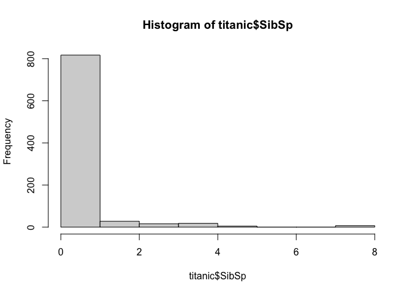
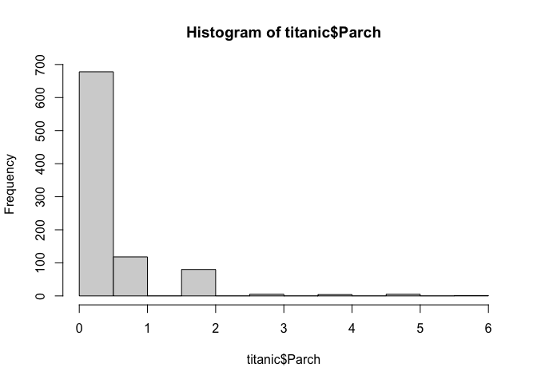
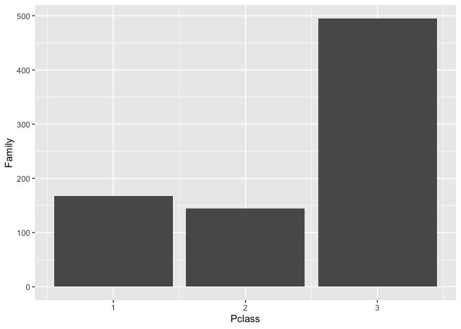
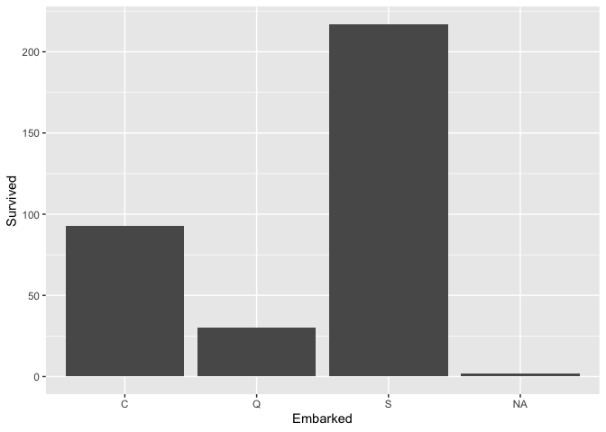

assignment\_5
================
Nicole Szeluga
10/26/2020

``` r
library(tidyverse)
```

    ## ── Attaching packages ────────────────────────────────────────────────────────────────────────────────────────────────────────────────────────────────── tidyverse 1.3.0 ──

    ## ✓ ggplot2 3.3.2     ✓ purrr   0.3.4
    ## ✓ tibble  3.0.3     ✓ dplyr   1.0.2
    ## ✓ tidyr   1.1.2     ✓ stringr 1.4.0
    ## ✓ readr   1.3.1     ✓ forcats 0.5.0

    ## ── Conflicts ───────────────────────────────────────────────────────────────────────────────────────────────────────────────────────────────────── tidyverse_conflicts() ──
    ## x dplyr::filter() masks stats::filter()
    ## x dplyr::lag()    masks stats::lag()

``` r
library(knitr)
```

<br>

## Exercise 2. Weather station

This dataset contains the weather and air quality data collected by a
weather station in Taiwan. It was obtained from the Environmental
Protection Administration, Executive Yuan, R.O.C. (Taiwan).

<br>

#### 2.1 The text file `https://raw.githubusercontent.com/nt246/NTRES6940-data-science/master/datasets/2015y_Weather_Station_notes.txt` contains desciptions of different variables collected by the station. Import it into R and print it in a table as shown below.

``` r
weather <-  read_delim(file ='https://raw.githubusercontent.com/nt246/NTRES6940-data-science/master/datasets/2015y_Weather_Station_notes.txt', '-', col_names = TRUE)
```

    ## Parsed with column specification:
    ## cols(
    ##   Item = col_character(),
    ##   Unit = col_character(),
    ##   Description = col_character()
    ## )

``` r
print(weather)
```

    ## # A tibble: 15 x 3
    ##    Item       Unit    Description                                              
    ##    <chr>      <chr>   <chr>                                                    
    ##  1 AMB_TEMP   Celsius Ambient air temperature                                  
    ##  2 CO         ppm     Carbon monoxide                                          
    ##  3 NO         ppb     Nitric oxide                                             
    ##  4 NO2        ppb     Nitrogen dioxide                                         
    ##  5 NOx        ppb     Nitrogen oxides                                          
    ##  6 O3         ppb     Ozone                                                    
    ##  7 PM10       μg/m3   Particulate matter with a diameter between 2.5 and 10 μm 
    ##  8 PM2.5      μg/m3   Particulate matter with a diameter of 2.5 μm or less     
    ##  9 RAINFALL   mm      Rainfall                                                 
    ## 10 RH         %       Relative humidity                                        
    ## 11 SO2        ppb     Sulfur dioxide                                           
    ## 12 WD_HR      degress Wind direction (The average of hour)                     
    ## 13 WIND_DIREC degress Wind direction (The average of last ten minutes per hour)
    ## 14 WIND_SPEED m/sec   Wind speed (The average of last ten minutes per hour)    
    ## 15 WS_HR      m/sec   Wind speed (The average of hour)

<br>

#### 2.2 Import `https://raw.githubusercontent.com/nt246/NTRES6940-data-science/master/datasets/2015y_Weather_Station.csv` into R. As you can see, this dataset is a classic example of untidy data: values of a variable (i.e. hour of the day) are stored as column names; variable names are stored in the `item` column. Clean this dataset up by turning it into a tidy format. Also, parse the `date` variable into date format and parse `hour` into time. Turn all invalid values into `NA` and turn `NR` in rainfall into `0`. Parse all values into numbers. Show the first 6 rows and 15 columns of this cleaned dataset, as shown below. (Hint: you don’t have to do these tasks in the given order.)

``` r
weather_untidy <- read_csv("https://raw.githubusercontent.com/nt246/NTRES6940-data-science/master/datasets/2015y_Weather_Station.csv")
```

    ## Parsed with column specification:
    ## cols(
    ##   .default = col_character(),
    ##   date = col_date(format = "")
    ## )

    ## See spec(...) for full column specifications.

``` r
weather_untidy[1:6,1:15]
```

    ## # A tibble: 6 x 15
    ##   date       station item  `00`  `01`  `02`  `03`  `04`  `05`  `06`  `07`  `08` 
    ##   <date>     <chr>   <chr> <chr> <chr> <chr> <chr> <chr> <chr> <chr> <chr> <chr>
    ## 1 2015-01-01 Cailiao AMB_… 16    16    15    15    15    14    14    14    14   
    ## 2 2015-01-01 Cailiao CO    0.74  0.7   0.66  0.61  0.51  0.51  0.51  0.6   0.62 
    ## 3 2015-01-01 Cailiao NO    1     0.8   1.1   1.7   2     1.7   1.9   2.4   3.4  
    ## 4 2015-01-01 Cailiao NO2   15    13    13    12    11    13    13    16    16   
    ## 5 2015-01-01 Cailiao NOx   16    14    14    13    13    15    15    18    19   
    ## 6 2015-01-01 Cailiao O3    35    36    35    34    34    32    30    26    26   
    ## # … with 3 more variables: `09` <chr>, `10` <chr>, `11` <chr>

``` r
weather_tidy <- pivot_longer(weather_untidy, cols = 4:27, names_to = 'hour', values_to = 'value') %>% 
  mutate(value=ifelse(value == "NR", 0, value),
         value=parse_double(value), 
         hour=parse_time(hour, "%H")) %>% 
  pivot_wider(names_from = 'item', values_from= 'value')
```

    ## Warning: Problem with `mutate()` input `value`.
    ## ℹ 1319 parsing failures.
    ##  row col               expected actual
    ## 2556  -- no trailing characters      #
    ## 2560  -- no trailing characters      #
    ## 2580  -- no trailing characters      #
    ## 2581  -- no trailing characters      #
    ## 2582  -- no trailing characters      #
    ## .... ... ...................... ......
    ## See problems(...) for more details.
    ## 
    ## ℹ Input `value` is `parse_double(value)`.

    ## Warning: 1319 parsing failures.
    ##  row col               expected actual
    ## 2556  -- no trailing characters      #
    ## 2560  -- no trailing characters      #
    ## 2580  -- no trailing characters      #
    ## 2581  -- no trailing characters      #
    ## 2582  -- no trailing characters      #
    ## .... ... ...................... ......
    ## See problems(...) for more details.

``` r
weather_tidy[1:6,1:15] 
```

    ## # A tibble: 6 x 15
    ##   date       station hour  AMB_TEMP    CO    NO   NO2   NOx    O3  PM10 PM2.5
    ##   <date>     <chr>   <tim>    <dbl> <dbl> <dbl> <dbl> <dbl> <dbl> <dbl> <dbl>
    ## 1 2015-01-01 Cailiao 00:00       16  0.74   1      15    16    35   171    76
    ## 2 2015-01-01 Cailiao 01:00       16  0.7    0.8    13    14    36   174    78
    ## 3 2015-01-01 Cailiao 02:00       15  0.66   1.1    13    14    35   160    69
    ## 4 2015-01-01 Cailiao 03:00       15  0.61   1.7    12    13    34   142    60
    ## 5 2015-01-01 Cailiao 04:00       15  0.51   2      11    13    34   123    52
    ## 6 2015-01-01 Cailiao 05:00       14  0.51   1.7    13    15    32   110    44
    ## # … with 4 more variables: RAINFALL <dbl>, RH <dbl>, SO2 <dbl>, WD_HR <dbl>

<br>

<br>

#### 2.3 Using this cleaned dataset, plot the daily variation in ambient temperature on September 25, 2015, as shown below.

``` r
weather_tidy %>% 
  filter(date == '2015-9-25') %>% 
  ggplot(, mapping = aes(x=hour, y = AMB_TEMP)) +
  geom_line()
```

<!-- -->

<br>

#### 2.4 Plot the daily average ambient temperature throughout the year with a **continuous line**, as shown below.

``` r
weather_tidy %>% 
  group_by(date) %>% 
  summarise('AMB_TEMP' = mean(AMB_TEMP)) %>% 
  ggplot(, mapping = aes(x=date, y = AMB_TEMP))+
  geom_line()
```

    ## `summarise()` ungrouping output (override with `.groups` argument)

<!-- -->

<br>

#### 2.5 Plot the total rainfall per month in a bar chart, as shown below. (Hint: seperating date into three columns might be helpful.)

``` r
weather_tidy %>% 
  separate(date, c("year","month","day"), sep = "-", remove = FALSE) %>% 
  group_by(month) %>% 
  summarise('MonthlyRainfall' = sum(RAINFALL, na.rm = TRUE)) %>% 
  ggplot(, mapping = aes(x=month, y=MonthlyRainfall))+
  geom_bar(stat = "identity")
```

    ## `summarise()` ungrouping output (override with `.groups` argument)

<!-- -->

<br>

#### 2.6 Plot the per hour variation in PM2.5 in the first week of September with a **continuous line**, as shown below. (Hint: uniting the date and hour and parsing the new variable might be helpful.)

``` r
library(lubridate)
```

    ## 
    ## Attaching package: 'lubridate'

    ## The following objects are masked from 'package:base':
    ## 
    ##     date, intersect, setdiff, union

``` r
weather_tidy %>% 
  filter(date >= as.Date('2015-09-01')& date<= as.Date('2015-09-07')) %>% 
  unite(time, date, hour, sep = " ") %>% 
  mutate(time = ymd_hms(time)) %>% 
  ggplot() +
  geom_line(mapping = aes( x = time, y= PM2.5))
```

<!-- -->

<br>

## Exercise 3: Titanic passengers

This dataset contains information about a subset of the passengers who
were aboard the Titanic when it sank in 1912.

``` r
titanic<-read_csv("https://raw.githubusercontent.com/nt246/NTRES6940-data-science/master/datasets/Titanic.csv")
```

    ## Parsed with column specification:
    ## cols(
    ##   PassengerId = col_double(),
    ##   Survived = col_double(),
    ##   Pclass = col_double(),
    ##   Name = col_character(),
    ##   Sex = col_character(),
    ##   Age = col_double(),
    ##   SibSp = col_double(),
    ##   Parch = col_double(),
    ##   Ticket = col_character(),
    ##   Fare = col_double(),
    ##   Cabin = col_character(),
    ##   Embarked = col_character()
    ## )

``` r
kable(head(titanic))
```

| PassengerId | Survived | Pclass | Name                                                | Sex    | Age | SibSp | Parch | Ticket           |    Fare | Cabin | Embarked |
| ----------: | -------: | -----: | :-------------------------------------------------- | :----- | --: | ----: | ----: | :--------------- | ------: | :---- | :------- |
|           1 |        0 |      3 | Braund, Mr. Owen Harris                             | male   |  22 |     1 |     0 | A/5 21171        |  7.2500 | NA    | S        |
|           2 |        1 |      1 | Cumings, Mrs. John Bradley (Florence Briggs Thayer) | female |  38 |     1 |     0 | PC 17599         | 71.2833 | C85   | C        |
|           3 |        1 |      3 | Heikkinen, Miss. Laina                              | female |  26 |     0 |     0 | STON/O2. 3101282 |  7.9250 | NA    | S        |
|           4 |        1 |      1 | Futrelle, Mrs. Jacques Heath (Lily May Peel)        | female |  35 |     1 |     0 | 113803           | 53.1000 | C123  | S        |
|           5 |        0 |      3 | Allen, Mr. William Henry                            | male   |  35 |     0 |     0 | 373450           |  8.0500 | NA    | S        |
|           6 |        0 |      3 | Moran, Mr. James                                    | male   |  NA |     0 |     0 | 330877           |  8.4583 | NA    | Q        |

And here are descriptions of the variables in the dataset

``` r
notes<-read_csv("https://raw.githubusercontent.com/nt246/NTRES6940-data-science/master/datasets/Notes.csv")
```

    ## Parsed with column specification:
    ## cols(
    ##   Variable = col_character(),
    ##   Definition = col_character(),
    ##   Key = col_character()
    ## )

``` r
kable(notes)
```

| Variable    | Definition                                  | Key                                            |
| :---------- | :------------------------------------------ | :--------------------------------------------- |
| PassengerId | Passenger ID                                | NA                                             |
| Survival    | Survival                                    | 0 = No, 1 = Yes                                |
| Pclass      | Ticket class                                | 1 = 1st, 2 = 2nd, 3 = 3rd                      |
| Name        | Pasenger name                               | NA                                             |
| Sex         | Sex                                         | NA                                             |
| Age         | Age in years                                | NA                                             |
| Sibsp       | \# of siblings / spouses aboard the Titanic | NA                                             |
| Parch       | \# of parents / children aboard the Titanic | NA                                             |
| Ticket      | Ticket number                               | NA                                             |
| Fare        | Passenger fare                              | NA                                             |
| Cabin       | Cabin number                                | NA                                             |
| Embarked    | Port of Embarkation                         | C = Cherbourg, Q = Queenstown, S = Southampton |

### Part 1.

**Answer the questions below** and use **figures or tables** to support
your answer. Choose the most appropriate type of figure or table for
each question.

#### 3.1 According to Wikipedia, there was an estimated 2,224 passengers and crew onboard the Titanic when it sank. How many of them do we have information on in this dataset? How many of them survived and how many did not? What is the overall survival rate?

``` r
total <- nrow(titanic)

survived <- titanic %>% 
  filter(Survived == "1") %>% 
  nrow()

dead<- titanic %>% 
  filter(Survived == "0") %>% 
  nrow()

survived/(survived+dead)
```

    ## [1] 0.3838384

We have information on 891 passengers and out of that list, 342 survived
and 549 died. This brings the survival rate to 38% <br>

#### 3.2 How many passengers on the Titanic were males and how many were females? What do you find when you break it down by ticket class?

``` r
male <- titanic %>% 
  filter(Sex == "male") %>% 
  nrow()

female <- titanic %>% 
  filter(Sex == "female") %>% 
  nrow()

titanic %>% 
  filter(Pclass == "1" & Sex == "male") %>% 
  nrow()
```

    ## [1] 122

``` r
titanic %>% 
  filter(Pclass == "1" & Sex == "female") %>% 
  nrow()
```

    ## [1] 94

``` r
titanic %>% 
  filter(Pclass == "2" & Sex == "male") %>% 
  nrow()
```

    ## [1] 108

``` r
titanic %>% 
  filter(Pclass == "2" & Sex == "female") %>% 
  nrow()
```

    ## [1] 76

``` r
titanic %>% 
  filter(Pclass == "3" & Sex == "male") %>% 
  nrow()
```

    ## [1] 347

``` r
titanic %>% 
  filter(Pclass == "3" & Sex == "female") %>% 
  nrow()
```

    ## [1] 144

577 passengers were male and 314 were female. Dividing this by class,
there are 122 males and 94 females in 1st class. 108 males and 76
females in 2nd class, and 347 males and 144 females in 3rd class.

<br>

#### 3.3 How many passengers of each sex survived and how many of them did not? What is the survival rate for passengers of each sex?

``` r
survived_male <- titanic %>% 
  filter(Survived == "1" & Sex == "male") %>% 
  nrow()

dead_male <- titanic %>% 
  filter(Survived == "0" & Sex == "male") %>% 
  nrow()

survived_female <- titanic %>% 
  filter(Survived == "1" & Sex == "female") %>% 
  nrow()

dead_female <- titanic %>% 
  filter(Survived == "0" & Sex == "female") %>% 
  nrow()

survived_female/female
```

    ## [1] 0.7420382

``` r
survived_male/male
```

    ## [1] 0.1889081

109 males and 233 females survived. 468 males and 81 females died. The
overall survival rate for each sex was 74% for females and 19% for
males.

<br>

#### 3.4 How many passengers do we have age information for (including estimated age)? For how many is the age information missing? What is the age distribution for passengers whose age information is available?

``` r
age_info <- titanic %>% 
  drop_na(Age) %>% 
  nrow()

total-age_info
```

    ## [1] 177

``` r
hist(titanic$Age)
```

<!-- -->

714 passengers have age information and 177 are missing information. For
the most part, the age distribution is a bell curve. The highest between
20-30 years old.

<br>

#### 3.5 Show the age distribution per ticket class, per sex. What do you find?

``` r
ggplot(data = titanic, mapping = aes(x = Pclass, y = Age, color= Sex)) +
  geom_histogram(stat = "identity", na.rm = TRUE, position = "dodge")
```

    ## Warning: Ignoring unknown parameters: binwidth, bins, pad

<!-- -->

I do not see any trend.

<br>

#### 3.6 What is the age distribution of passengers who survived vs. those who did not? What hypothesis can you come up with when comparing these two distributions?

``` r
titanic %>% 
  filter(Survived == "1") %>% 
  ggplot(, mapping = aes(x = Age, fill = Survived))+
  geom_histogram(bins = 30, position = "dodge", na.rm = TRUE)
```

<!-- -->

``` r
titanic %>% 
  filter(Survived == "0") %>% 
  ggplot(, mapping = aes(x = Age, fill = Survived))+
  geom_histogram(bins = 30, position = "dodge", na.rm = TRUE)
```

<!-- -->

I notice that more babies survived than died and more elderly died.

<br>

#### 3.7 In this dataset, the Fare variable does not represent the fare per person. Instead, each ticket number has a corresponding fare, and some passengers share one single ticket number. Therefore, the Fare variable is the total fare for a group of passengers sharing the same ticket number. Knowing this, calculate the average fare per person. (You don’t need to show a table or a figure for this question, just show the code for the calculation)

``` r
titanic %>% 
  group_by(Ticket) %>% 
  summarise("meanFare" = mean(Fare)) %>% 
  group_by() %>% 
  summarise("AverageFare" = mean(meanFare))
```

    ## `summarise()` ungrouping output (override with `.groups` argument)

    ## # A tibble: 1 x 1
    ##   AverageFare
    ##         <dbl>
    ## 1        23.3

I got the average fare per person to be 23.27

<br>

#### 3.8 Show the distribution of the number of family members (including siblings, spouses, parents, and children) that each passenger was accompanied by. Were most passengers travelling solo or with family?

``` r
hist(titanic$SibSp) 
```

<!-- -->

``` r
hist(titanic$Parch)
```

<!-- -->

My histograms show that most passengers were traveling alone.

<br>

#### 3.9 Which ticket class did most of the largest families get? And which ticket class has the lowest proportion of female passengers who travelled solo out of all the female passengers in that class?

``` r
titanic %>% 
  mutate(titanic,'Family' = SibSp + Parch) %>% 
  ggplot(, mapping = aes(x = Pclass, y = Family))+
  geom_bar(stat = "identity")
```

<!-- -->

I find that people with the most family are in the 3rd class.

<br>

#### 3.10 Do the port of embarkation matter for the survival rates of passengers? Why might this be the case?

``` r
ggplot(data = titanic, mapping = aes( y= Survived, x = Embarked)) +
  geom_bar(stat = "identity")
```

<!-- -->

More people survived that embarked on Southampton. This could be because
a larger number of overall people embarked here.Maybe it was a larger
port.
